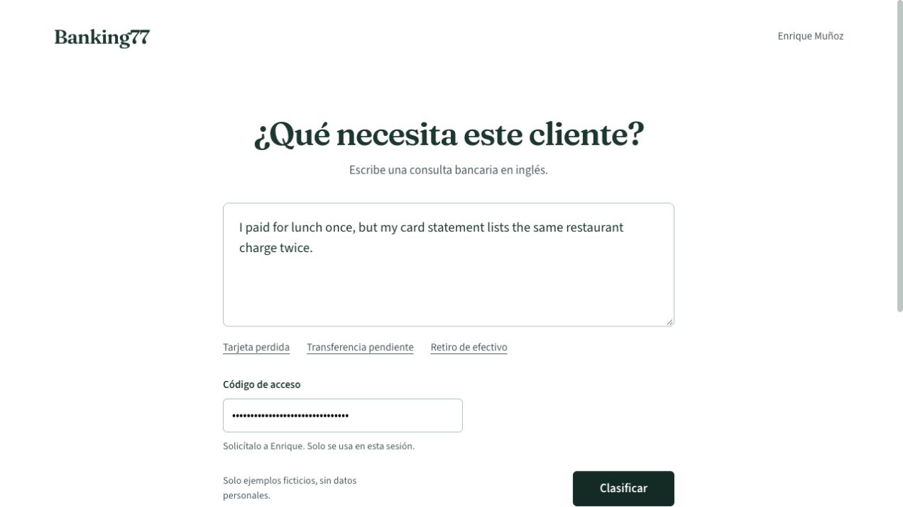

# Banking77 · Transformers y demo web

Clasificación de consultas bancarias en 77 intenciones con **DistilRoBERTa**, acompañada de un análisis exploratorio y un experimento de explicación de errores con **Falcon-7B-Instruct**.

Proyecto de Enrique Muñoz · Maestría de Inteligencia Artificial, Universidad Internacional de La Rioja.

[**Abrir demo**](https://enriquemunozdev--banking77-enrique-munoz-web.modal.run/) · [Notebook ejecutado](ai/notebooks/banking77.ipynb) · [Informe PDF](reports/Enrique_Munoz.pdf)



## Qué se puede probar

La web recibe consultas **nuevas en inglés** y ejecuta el clasificador entrenado; no devuelve respuestas precalculadas. Introduce una consulta ficticia y el código de acceso que facilita el autor. El código no está en este repositorio, para proteger el crédito de cómputo.

El clasificador está desplegado en CPU en Modal. **Falcon no está habilitado en la web**: la cuenta sin tarjeta utilizada para esta demostración no permite GPU T4. El experimento de Falcon del notebook sí contiene salidas de la ejecución académica en Colab. Son dos estados diferentes.

El servicio escala a cero; la primera consulta puede tardar unos 30 segundos. La disponibilidad depende del crédito de prueba. No introducir datos bancarios ni personales reales.

## Resultados del experimento

Test oficial: 3.080 consultas, 40 por categoría. Se reservó validación dentro del entrenamiento; no se eligieron parámetros usando el test.

| Modelo | Accuracy | F1 macro |
|---|---:|---:|
| TF-IDF + regresión logística | 85,03 % | 84,93 % |
| DistilRoBERTa ajustado | **92,82 %** | **92,82 %** |

Fuente: [métricas guardadas](ai/results/metrics.json). Son resultados del experimento académico, no una garantía sobre consultas arbitrarias. El notebook incluye el reporte por clase, las confusiones y veinte errores explicados por Falcon. La revisión de sus explicaciones es asistida y no equivale a una validación humana independiente ni a una explicación causal del Transformer.

## Estructura

```text
ai/
  notebooks/banking77.ipynb    # Datos, EDA, entrenamiento y evaluación
  results/                    # Métricas y reportes del experimento
web/
  index.html, styles.css      # Interfaz sin framework
  app.js, config.js           # Cliente de la API, sin secretos
  backend/                   # FastAPI, inferencia y despliegue Modal
  tests/                     # Contratos de API con dobles de prueba
reports/                     # Informe académico
scripts/                     # Comprobaciones de integridad de fuentes
.github/workflows/           # Pruebas automáticas, sin GPU
```

## Ejecutar el notebook

Abre [el notebook](ai/notebooks/banking77.ipynb) en Google Colab y selecciona GPU. Todo el código del experimento está en el cuaderno. La sección de preparación instala las dependencias y configura guardado persistente en Drive.

Entrenar y ejecutar Falcon requiere descargar modelos y disponer de GPU; la disponibilidad de Colab gratuito no está garantizada. Las salidas incluidas son evidencia de una ejecución anterior: abrir el archivo no ejecuta entrenamiento nuevo. Consulta [reproducibilidad](docs/reproducibility.md) antes de repetirlo.

## Ejecutar la web localmente

Python 3.12 recomendado. Desde la raíz:

```sh
python3 -m venv .venv
source .venv/bin/activate
pip install -r web/backend/requirements.txt
cd web
python -m backend.import_model /ruta/best.zip --destination /ruta/privada/banking77-best
export BANKING77_MODEL_DIR=/ruta/privada/banking77-best
python -m uvicorn backend.api:app --host 127.0.0.1 --port 8877 --no-access-log
```

Abre `http://127.0.0.1:8877/`. Los pesos ajustados **no se incluyen** en Git ni se sustituyen por un modelo base. El notebook permite generar el checkpoint; también puede solicitarse al autor. Sin checkpoint, la API devuelve indisponibilidad y la interfaz no simula predicciones.

## Pruebas

```sh
pip install -r web/backend/requirements-test.txt
(cd web && python -m pytest tests -q)
python scripts/check_repository.py
node --check web/app.js
```

Las pruebas de contrato usan dobles explícitos: no demuestran calidad del modelo ni inferencia GPU. Separadamente se comprobaron tres consultas nuevas en el endpoint real y una interacción en el navegador. La primera inferencia cloud tomó 22,45 s; las dos siguientes, aproximadamente 0,39 s, en esa muestra concreta.

## Despliegue

[Guía de Modal](docs/deployment.md). Web y API se sirven en el mismo endpoint, sin necesidad de un segundo servicio. Credenciales, código de acceso, pesos y registros privados quedan fuera del repositorio.

## Limitaciones

- El clasificador siempre elige entre 77 categorías: no detecta consultas fuera de dominio.
- Consultas en inglés; no se evaluó clasificación en español.
- Las puntuaciones softmax no son probabilidades calibradas.
- Se trunca a 128 tokens y se señala cuando ocurre.
- Falcon produce justificaciones posteriores, no revela el proceso interno de DistilRoBERTa.
- Los límites de solicitudes se reinician con el contenedor; no sustituyen el límite de gasto del proveedor.

## Fuentes

- [Banking77 / PolyAI](https://github.com/PolyAI-LDN/task-specific-datasets/tree/57ec275d8078af65b7731c2a98be812d844a6d6b/banking_data)
- [DistilRoBERTa](https://huggingface.co/distilbert/distilroberta-base)
- [Falcon-7B-Instruct](https://huggingface.co/tiiuae/falcon-7b-instruct)

Las licencias de datos y modelos son las de sus proveedores. Las fuentes tipográficas redistribuidas conservan sus archivos OFL en `web/assets/fonts/`. No se incluyen materiales privados del curso ni el documento de instrucciones.
